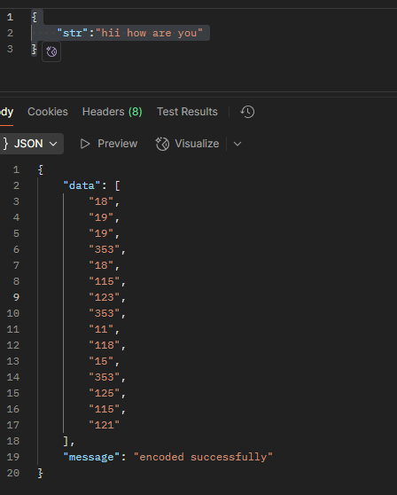
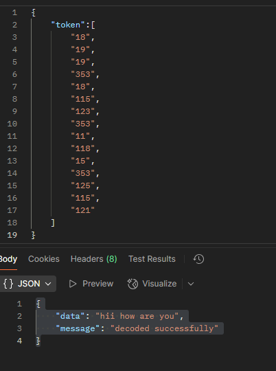

# tokenizer
a custom tokenizer in JavaScript that learns vocab from text, supports ENCODE/DECODE

# to run the project
1. clone the repository and run the following command
2. npm i
3. node index.js

# sample api

1. # encode

endpoint-/api/v1/encode

payload:
{
    "str":"hii how are you"
}

output:

{
    "data": [
        "18",
        "19",
        "19",
        "353",
        "18",
        "115",
        "123",
        "353",
        "11",
        "118",
        "15",
        "353",
        "125",
        "115",
        "121"
    ],
    "message": "encoded successfully"
}

2. # decode

endpoint-/api/v1/decode

payload:
{
    "token":[
        "18",
        "19",
        "19",
        "353",
        "18",
        "115",
        "123",
        "353",
        "11",
        "118",
        "15",
        "353",
        "125",
        "115",
        "121"
    ]
}

output:
{
    "data": "hii how are you",
    "message": "decoded successfully"
}

